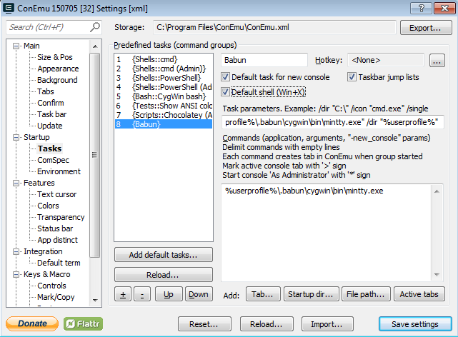

###[Babun](http://babun.github.io/) - [github](https://github.com/babun/babun)

Babun is a set of tools. It basically sets you up with Cygwin, mintty (a console replacement), and a nice zsh configuration (a bash shell extension) among other things. It has a simple package manager called *pact* to manage versions of its own components. It's really not anything new itself, but rather, puts a lot of useful things, in a nice configuration, under one roof. Don't worry if you don't know what Cygwin, zsh, or bash are, it will become clear in time.

#####Install Babun
	
* Download & extract `.zip` file, click into `babun-{version}` and double-click `install.bat`.

For more information about the babun shell and some tips for working in a unix-like environment, see the "Using Cygwin" section below.

#####ConEmu

You will need to add a profile for the babun shell, if it does not detect it automatically. If you like, you can just import my settings from [./config/conemu/conemu.xml](config/conemu/conemu.xml); just click "Import" in the settings dialog. This includes some font and color customizations. It uses a fantastic free font called [DejaVu Sans Mono](http://dejavu-fonts.org/wiki/Download). If you don't have this installed, it will just warn you and fall back to another font. Alternatively, you can set up the profile as follows:

* Choose "Settings" from within the console, select "Startup > Tasks" from the menu.
* Click "+" to create a new task/command group, and enter the following:
	* Name: Babun
	* Check "Default task for new console" and "Default shell"
	* Task Parameters: `/icon "%userprofile%\.babun\cygwin\bin\mintty.exe" /dir "%userprofile%" `
	* Commands: `"%userprofile%\.babun\cygwin\bin\mintty.exe"`

#####Maintenance

Babun updates some stuff automatically, but it doesn't automatically update the Cygwin tools. For the most part this doesn't matter, but you do want to make sure your `git` client is up to date:

    > pact update git

Now that you've got git on your computer, I suggest you clone this repo too, so you can easily access the files and maybe make changes and improve it too:
 
    > git clone https://github.com/jamietre/node-windows.git
    
This will clone the repository in a folder of the same name, `node-windows`. To make your babun shell even better, you can use the customized zsh configuration just by copying it to your home directory:

    > cp node-windows/config/user/.* ~

This adds the following inline editing using Windows conventions, and command line launchers for useful windows editors and applications:

* `edit` to edit a filename with a bound editor
* `ex` to open windows explorer
 
See "Zsh Extras" below for more details.

#####Internet Utilities

Cygwin includes implementations of standard command line tools like `telnet`, `ssh` and so on. These are not installed by default, but come in handy a lot, e.g. to test if chrome is running with remote debugging enabled:

    > telnet locahost 9222
   
To install the Cygwin internet toolset via Babun, just type:

    > pact install inetutils

*TODO - this section is far from complete*
* basic commands (ls, grep, etc)

When you open a babun shell, it starts in your home directory. Your home directory is always aliased to `~` so at any point you can return to it by typing `cd ~`. This maps to the real filesystem location of 

	C:\users\{username}\.babun\cygwin\home\{username}

In the unix world, you always use forward slashes `/` in file paths. There is also no concept of a drive letter. Cygwin maps your drives to root folders mounted as `/c`, `/d`, and so on. So `c:\temp\file.txt` would be found under `/c/temp/file.txt` within a cygwin environment.

Cygwin has a command to map any relative or hard path to Windows. For example, if your current directory is your home directory, typing this:

	> cygpath -w -a test.txt

would return

	`C:\Users\{USERNAME}\.babun\cygwin\home\{username}\test.txt`

##Using Zsh

Zsh is the shell; it's an extension of a standard bash shell. The shell is basically a command processor, like DOS shell or Powershell. Zsh has it's own scripting language and a number of features for making working on a command line easier.

###Default Babun Configuration
 
Zsh has many powerful automation features, see a complete reference here (TODO). Babun uses oh-my-zsh to manage Zsh profiles. It comes configured with the [these key bindings](https://github.com/robbyrussell/oh-my-zsh/edit/master/lib/key-bindings.zsh), highlights are:

* `TAB` will autocomplete file names from the current directory 
* Cursor up & down scroll through command line history
* Start typing + cursor up/down to fuzzy search for text in history
* `CTRL+R` - general command line history search

The extension `.zsh-keys.sh` in this repository adds full support for windows-like edition conventions.
 
The extension `.zsh-launchers.sh` in this repository adds the following commands:

* `edit {filepath}` - edit file identified by `{filepath}` using a Windows editing tool  

###Zsh Extras

If you copy the files from `./config/user` into your home directory you get this stuff too.

##### Inline editing using windows conventions

most things work as you expect. See [this post](http://stackoverflow.com/questions/5407916/zsh-zle-shift-selection/30899296#30899296) for details.

##### Integration of Windows editors and tools from the command line:

You will probably need to adjust this for your specific toolset, but configuration is trivial in `~/.zshrc-launchers.sh`

* `edit filename.ext` - launch a configured editor based on file extension:
* `markdown filename` - open always with markdown editor
* `subl filename` - open always with sublime text
	* `subl .` - open the current folder with sublime text
* `notepad filename` - open always with notepad
* `vs filename` - open always with Visual Studio
* `explore` - launch windows explorer from the current directory
	* `explore ~` will explore your home directory
	* `explore $PROGRAMFILES` will explore `c:\program files (x86)`
	* 
* `chrome index.html` - launch chrome and display `index.html` in the current folder from the filesystem
	* `chrome http://www.xkcd.com` - open chrome to the specified URL
	* `chrome-debugger http://localhost/app` - open chrome with remote debugging enabled on port 9222, using a profile home in `~/.chrome` (different from your Windows default Chrome profile)

The default config uses Markdown Pad for `.md` files, Visual Studio for `.js` and `.json`, and Sublime Text for anything else.

##Problems

**There are issues with mintty 2.1.3 and ConEmu,** see [this](https://github.com/Maximus5/ConEmu/issues/239). ~~Probably will be~~ Was fixed in  mintty 2.1.4. In 2.1.3 only you can workaround by adding -d to the invocation for mintty in ConEmu: `"%userprofile%\.babun\cygwin\bin\mintty.exe" -d` .

If you have a problem with the console docking in Conemu, most likely you can fix it by updating mintty: `pact update mintty`
 
**Conflicting version of git/git bash** -- you may have Git installed separately, as a result of installing Git for Windows previously, or as installed by something that depends on it. Most likely this will be found e.g. under 'c:\Program Files (x86)\git\bin`. If this is on your path, it could cause issues with Cygwin, because of conflicting versions of the command line utilities (git included).

It's recommended that you remove `c:\Program Files (x86)\git\bin` from your path, and add to the **user variables** PATH your cygwin bin folder, e.g. `c:\users\{username}\.babun\cygwin\bin;`

**Using ~ in paths passed to  npm** -- It doesn't work. `~` maps to `c:\home\{username}` instead of the actual Cygwin home of `C:\Users\{username}\.babun\cygwin\home\{username}` or wherever. Seems like this should be fixable; problem is that invoking Windows things from cygwin doesn't do path remapping. We can create an alias (probably) that just `cygpath`'s first.
