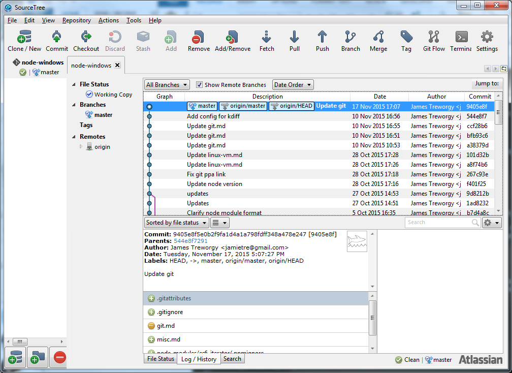

## GIT with Windows Primer

### Basic Git Client Configuration

These steps generally should be done for any Windows configuration with Git.  First install Git for Windows 2.5+

##### Set basic profile information:

        git config --global user.name "Buzz Lightyear"
        git config --global user.email "buzzl@nasa.gov"

##### Set git to use windows credential store:

        git config --global credential.helper wincred

##### Fix firewall issues with git protocol dependencies:

        git config --global url."https://github.com/".insteadOf git@github.com:
        git config --global url."https://".insteadOf git://

##### Turn off auto CR/LF transformations

       git config --global core.autcrlf=false

##### Make push only push your current branch

       git config push.default current

##### Configure an editor

	Some git commands launch an editor that is expected to block the process; when the editor exits (after you save changes) the operation will proceed.In windows the format is a little tricky for the path. For example, this will launch Sublime Text 3 and wait for you to close the document:  

        git config --global core.editor "'C:/Program Files/Sublime Text 3/subl.exe' -w"

Notepad++

        git config --global core.editor \
            "'C:/Program Files/Notepad++/notepad++.exe' -multiInst -notabbar -nosession -noPlugin" 

##### Configure diff & merge tools

Recommendations:

##### Set up p4merge as your diff and merge tool

[P4Merge](http://www.perforce.com/downloads/helix?qt-perforce_downloads_step_3=1#product-10)

P4Merge has a nice UI and is pretty easy to use. Note: when installing P4Merge, the installer by default includes a whole toolset which you don't want. Uncheck everything except P4 Merge, or you will be asked questions that don't make sense during installation.

    git config --global merge.tool p4merge
    git config --global diff.tool p4merge

    git config --global difftool.p4merge.path "\"c:\program files\perforce\p4merge.exe\""
    git config --global mergetool.p4merge.cmd "\"c:\program files\perforce\p4merge.exe\" 
        \"$BASE\" \"$LOCAL\" \"$REMOTE\" \"$MERGED\""

##### Alternative: Set up kdiff as diff and merge tool

[kdiff](http://kdiff3.sourceforge.net/)

KDiff is open source and powerful, but harder to use.

    git config --global merge.tool kdiff
    git config --global diff.tool kdiff

    git config --global difftool.kdiff3.path "\"C:\Program Files\KDiff3\kdiff3\""
    git config --global mergetool.kdiff3.cmd "\"C:\Program Files\KDiff3\kdiff3" "$BASE" "$LOCAL" "$REMOTE" -o "$MERGED""

##### Using diff & merge tools

To use the gui to do diffs: 

    git difftool <left-branch> <right-branch>

Or to just compare unstaged changes with your local head
    
    git difftool

To use the gui to perform merges when merge conficts exist

    git mergetool

Sometimes temporary files get left behind after a merge. Run `git status` to see that everything untracked is junk; if so 

    git clean -f

will take care of it.

##### SourceTree

A much better git client than `gitk` is Atlassian's [SourceTree](https://www.sourcetreeapp.com/). This gives you a nice GUI with commit history and branching to see the state of a repository. If you add an alias to it, you can just invoke it from the command line when your current directory is a git repo, and it will automatically show you that repo, for example:

    alias stree="C:\Program Files (x86)\Atlassian\SourceTree\SourceTree.exe"

Now you can just type `stree` at the command prompt and you'll get the view into your repo. Note that if you want this alias available every time you open a new command shell, you'll need to add it to a startup script, which depends on the shell you're using.

* If you are using TCC/LE, you can use [tcstart.btm](tcstart.btm) to accomplish this. 
* If using a regular DOS shell, [it's a little trickier](http://superuser.com/questions/302194/automatically-executing-commands-when-a-command-prompt-is-opened). 
* If using the git bash or other bash shell on windows, [see this](http://superuser.com/questions/602872/how-do-i-modify-my-git-bash-profile-in-windows) for details.

Example SuperUser window:

###TFS Git

To manage Git repositories in TFS/GIT the web interface seems easiest. Go to:

	http://[server]/tfs/[collection]/[project]/_admin

For example:

    http://devgitserver:8080/tfs/OurCollection/OurProject/_admin

From here the UI allows creating and deleting repositories within the "Prototype2" project. The actual URL you will use to communicate from the git client is similar:

	http://[server]/tfs/[collection]/[project]/_git/[repository]

For example:

    http://devgitserver:8080/tfs/OurCollection/OurProject/_git/awesome-widget

To create a new repo from TFS Git, go to the version control tab on the admin page: 

    http://[server]/tfs/[collection]/[project]/_admin/_versioncontrol

Click "New Repository." Then clone it:

   git clone http://[server]/tfs/[collection]/[project]/_git/[repository]

.. now go to it. Either move your existing code into the folder `[repository]` that has been created, or do `git init` to get started.

###Basic Git Tasks

####Initialize a new repo

After you create a new repo on Github or TFS, it is initially empty. Follow these steps to initialize it; this works fine in a new folder or with existing code. This is taken directly from [github's reference.](https://help.github.com/articles/adding-an-existing-project-to-github-using-the-command-line/).

    git init
    git add .
    git commit -m 'First commit'
    git remote add origin [https://mygitserver/url.git]
	git push origin master

#####Push changes

    git add -A
	git add -An   #dry run - shows files that will be added
    git commit -m 'New changes'
    git push origin master

#####Tag a version

    git tag v1.0.6
    git push origin master --tags
    

#####Update from remote

    git pull

Note that `git pull` actually does two things: `git fetch` which syncs remote changes to your local repository, and `git merge` which brings your local commits in sync. You may not always want to do this, especially if changes are extensive. An alternative worflow is:

#####Compare staged changes to remote

    git diff --stat --cached [remote branch]

e.g.

    git diff --stat --cached origin/master

#####Interactively compare your local staged changes with remote

This will sync the local HEAD with the remote, and compare your local to the unmerged remote: 

    git fetch
    git difftool origin/master

##### Compare your unstaged changes with local HEAD

This will simply show you what you've changed that's not yet committed.

    git difftool

#### Branching

It's trivial to create branches, so it is recommended to do so before committing any significant changes that are not ready to be merged with the master. This is a summary, here is a nice writeup of some [common workflows](https://github.com/Kunena/Kunena-Forum/wiki/Create-a-new-branch-with-git-and-manage-branches)

##### Create a new branch

    git checkout -b [my-new-branch]    #creates & switches to new branch
    git push origin [my-new-branch]

##### Switch branches

    git checkout [some-branch]

##### Show all branches

    git branch -r

#### Delete branch

    git branch -D **branch-name**      // delete local
    git push origin --delete **branch-name**    // delete remote

### Forking

#### Set up a fork first

Create a fork using github then clone your fork:

    git clone [remote-url]
    git add 
    git remote add upstream [upstream-url]

#### Keep in sync

Method 1 - reapply all your changes. This is best if you plan to make pull requests against upstream, but may be more work.

    git fetch upstream
    git rebase upstream/master

Method 2 - merge changes from master to your fork

    git fetch upstream
    git merge upstream/master

Push changes to your fork:

    git push -f origin master

###Fixing Mistakes

Some handy things, from the [definitive reference](https://github.com/blog/2019-how-to-undo-almost-anything-with-git):

**You did `git add` and it's all wrong**

    git reset

**You made has a spelling mistake** and you don't want to be mocked my your peers.

	git commit --amend -m "Fixed"
    git commit --amend                 # launches your editor
     

You can also add more changes before amending the commit with `git add`.

**You just want to undo the last commit entirely**... but I haven't pushed it yet, just a mulligan:

    git reset --soft HEAD~1

**Roll back a file to the last committed version**

    git checkout -- <bad filename>

**Roll back a push to the remote** -- you pushed some bad code. This makes a new commit that undoes exactly the last commit, preserving history.

    git revert <SHA>                  #can be obtained from the TFS or Github URL
    git push origin master

 

