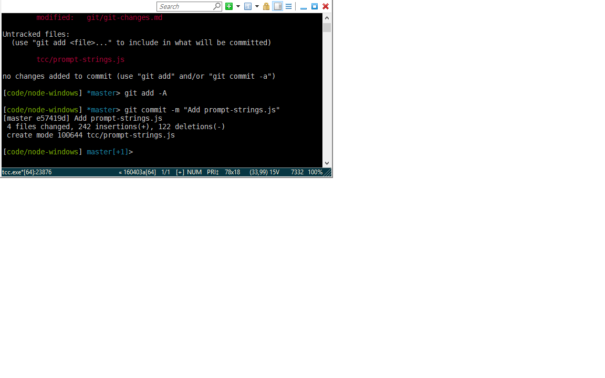

###[TCC/LE](https://jpsoft.com/tccle-cmd-replacement.html) 

TCC/LE is a CMD replacement. It has nice editing/history features, is extensible. It integrates nicely with ConEmu. 

* [ConEmu configuration with TCC](./tcc/conemu.md) - some suggestions for best results when using TCC with ConEmu.

With TCC you can get a pretty nice working environment set up. Some recommendations:

### Startup and Shutdown File

The `tcstart.btm` file will be run automatically if found in your home directory or the application startup folder.  Likewise, the `tcexit.btm` file will be run when leaving a shell in the same circumstances.

It has settings which can configure the default behavior. This is an old-school windows-style INI file. These settings are managed from the TCC (paid edition) UI so online documentation is a difficult find, but here is a useful configuration:

A suggested `tcstart.cmd` is (here)[./tcc/tcstart.ini]

### Configuration file

The file `tcmd.ini` is searched for in the following locations:

* `c:\Users\{UserName}\AppData\Local\JpSoft\tcmd.ini`
* `C:\Program Files\JPSoft\TCCLE14x64\tcmd.ini` -- the app launch folder

#### Suggested configuration:

    [4NT]
	EditMode=Insert
	UnixPaths=Yes
	AppendToDir=Yes
	CursorIns=15
	CursorOver=100
	AutoCancel=Yes
	DirJunctions=Yes
    PathExt=No
    ExpandPseudovariables=Yes
    CMDVariables=No
    ANSI=Yes
    TCStartPath=c:\Users\{UserName}

You can download this (here)[./tcc/tcmd.ini].

* `EditMode` is the default editing mode on a command line; "insert" is typical for Windows applications.
* `UnixPaths` allows limited use of forward slashes.
* `AppendToDir` adds a backslash when autocompleting a folder name
* `CursorIns` is the percentage width for the cursor while in insert mode (15% is basically a vertical bar)
* `CursorOver` is the percentage width for the cursor while in overstrike mode (100% is a block)
* `AutoCancel` will allow you to break a script with CTRL+C without the annoying "Do you want to stop this batch file?" prompt.
* `DirJunctions` - [TODO] not sure... I went out of my way to add this but can't find reference now
* `PathExt`

[*PathExt*](http://jpsoft.com/help/inistartupdlg.htm) is a boolean which, when enabled, causes TCC to look at the [`PATHEXT`](http://jpsoft.com/help/pathext.htm) environment variable, which is a semicolon-delimited list of file extensions (including the dot), and search for any file matching any extension on this list.
    
Note than when using `PathExt`, by default, `.BTM` files will probably not be considered executable, and some default behavior (such as running the startup file `tcstart.btm`, below) will not work. [See this](http://jpsoft.com/help/pathext.htm) for more information.

* `TCStartPath`

[*TCStartPath*](http://jpsoft.com/help/cmdlineopts.htm) defines an alternate location for look for startup files.

### Aliases

You can create aliases for any number of things, like presetting options on commands you use a lot. 

    @alias ls=ls.exe --color=auto

Note that TCC is not smart enough to not search aliases when executing commands; in bash you could just say `alias ls=ls --color=auto`. By using `ls.exe` I avoid a self-referential issue.

### Colors

Sometimes the ansi color scheme gets messed up. This will reset it:

    color 07

### Command prompt

With a real bash shell, you have all kinds of shell replacements like zsh and fish. We have no such thing. The biggest thing I miss is a decent command prompt, though. With TCC this is easy to do.

* Download [prompt-strings.js](./tcc/prompt-strings.js)
* Put it somewhere under your home directory, e.g. a folder called `.scripts`
* Add the following to your `tcstart.ini`

    @prompt \`%@EXECSTR[node %home/.scripts/prompt-strings.js git-prompt]\`

This just runs a node app to obtain the text for your prompt, that looks like this:

The prompt provides the last two segments of the working directory, and a git status indicator (if applicable) that tells you whether anything is dirty (*) and the number of commits ahead or behind you are from master (+1)

Since it's just javascript it should be easy enough to make any kind of prompt you want.
